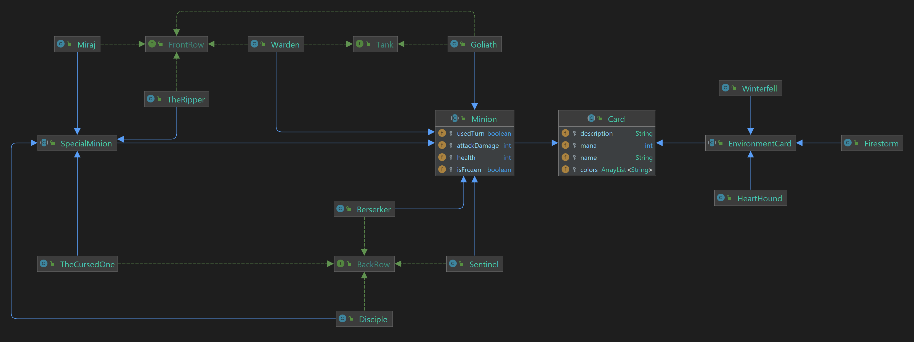
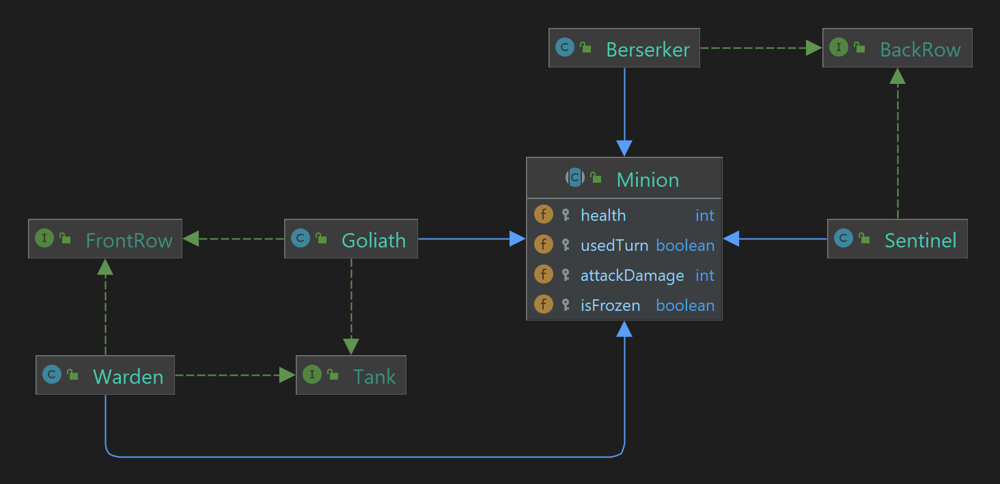
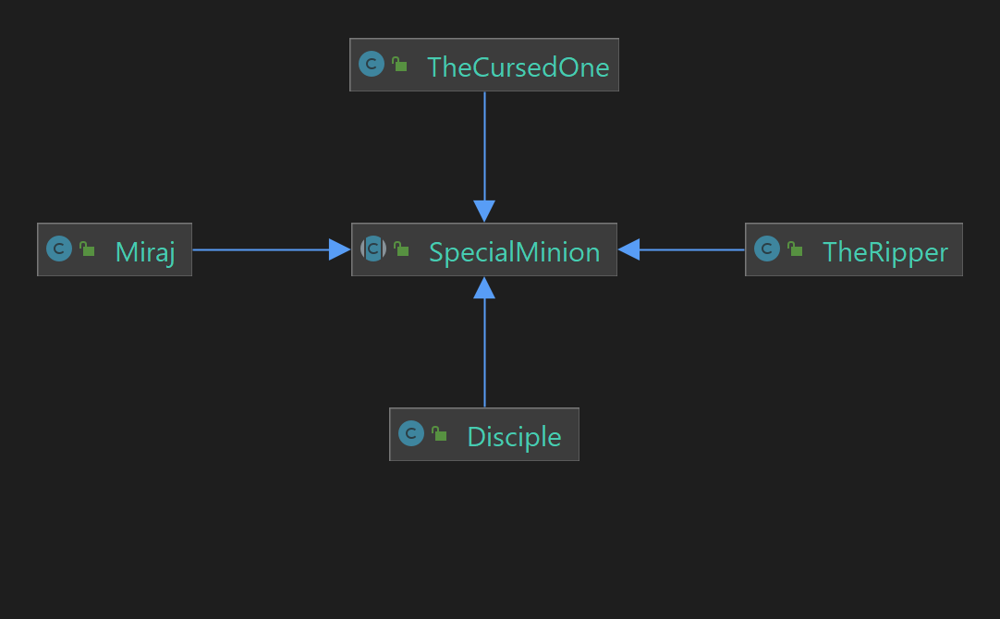
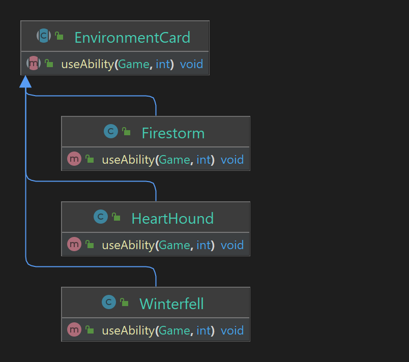
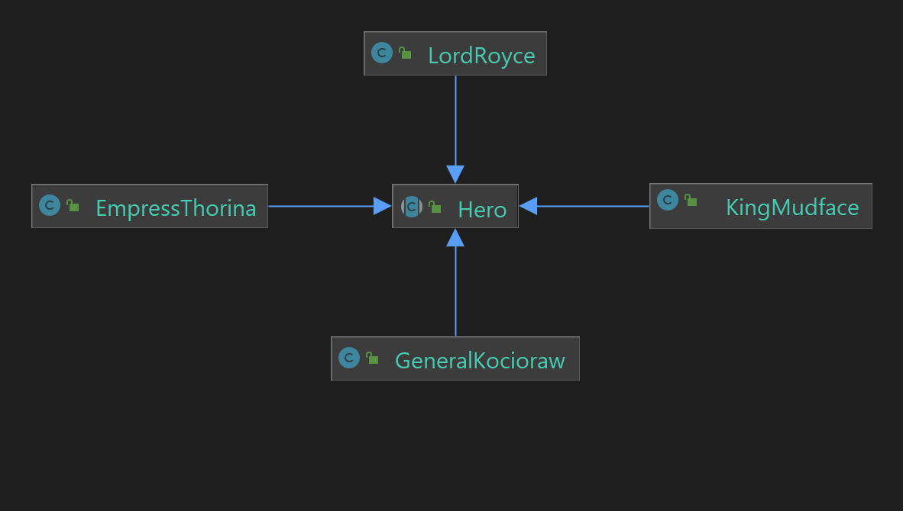
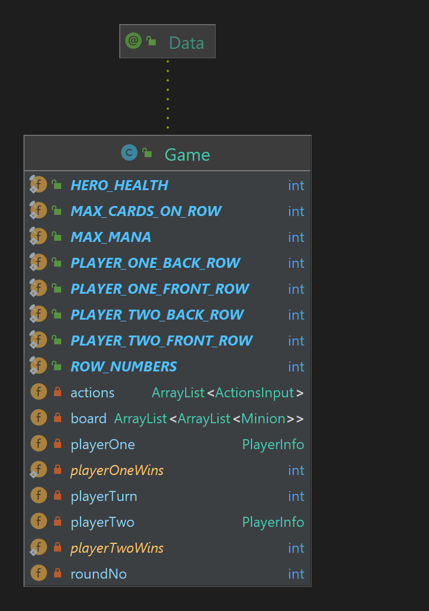
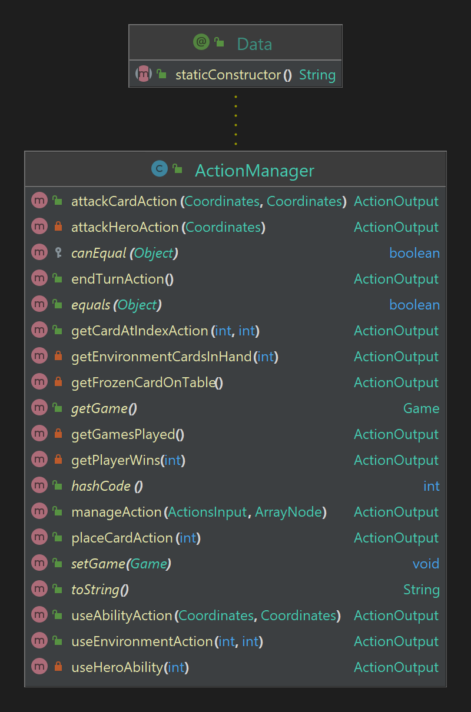
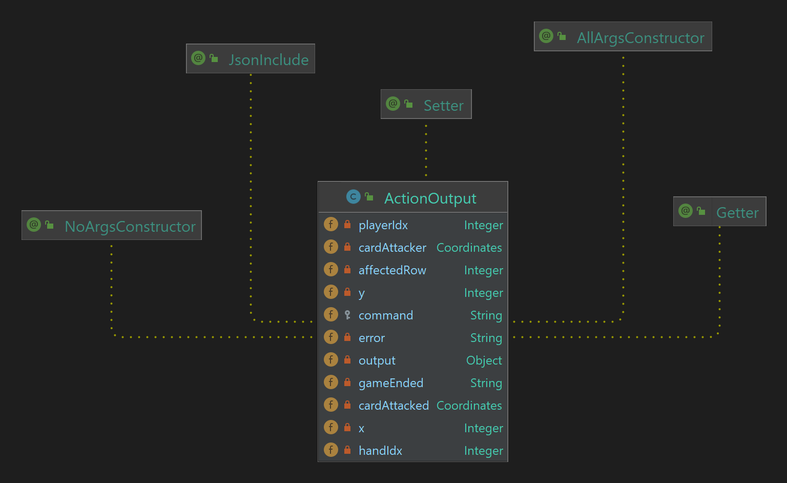

# Tema POO  - GwentStone
### Name: Mihai-Alexandru Lățea
#### Group: 321CA
<br> </br>

#### Assignment Link: [https://ocw.cs.pub.ro/courses/poo-ca-cd/teme/tema](https://ocw.cs.pub.ro/courses/poo-ca-cd/teme/tema)


## Card structure


* **Tank** interface - _marking_ interface showing that a card is a tank,\
meaning that it will protect the other cards from attacks and spells.
* **FrontRow** and **BackRow** - _marking_ interfaces showing that a card\
should be placed on the front or back row on the table.

### Cards

*  **Card** class - contains common information about a playing card such as:\
mana, description, color palette and name. This class is the base class for\
all cards that can be played.



 * **Minion** class - contains information about a minion such as:
health, attack damage, states like being frozen or if it attacked in a turn.
This class is the base class for all cards that can pe placed on the table.
    * **Warden**, **Goliath**, **Sentinel**, **Berserker**, **Special Minion** are concrete\
    implementations of minion cards; Goliath and Warden can be placed on the front\
    row and are tanks; Sentinel and Berserker can be placed in the back.
<br> </br>
      
    * **Special minion** - base class for minions that have a special ability.
      * **The Ripper**, **The Cursed One**, **Miraj**, **Disciple** - concrete implementations for special minion.
        * _The Ripper_ - Weak Knees ability - give -2 attack damage to an enemy minion;
        * _Miraj_ - Skyjack - Swap an enemy minion's health with this card health;
        * _The Cursed One_ - Shapeshift - swap an enemy health with its attack damage;
        * _Disciple_ - God's Plan - Give +2 health to a friendly minion.
 <br> </br>
        
      * **Environment** Cards - base class for spell cards that cannot be placed
      on the table but can affect it.
        * **Firestorm**, **HeartHound**, **Winterfell** - concrete card implementations;
          * _Firestorm_ - give 1 damage to all enemies in a row;
          * _HeartHound_ - Steal the enemy minion with the biggest health from a row;
          * _Winterfell_ - Freeze all minions from a row.
 
### Heroes
These are special cards that are not playable\
on the board and have unique abilities that can be used every turn.



   * **Lord Royce**, **Empress Thorina**, **King Mudface**, **General Kocioraw** - concrete hero implementations;
   * **Hero** class - base class that contains information such as name, description\
mana, color pallette, etc.
       * _Lord Royce_ - Sub-Zero -> Freeze the enemy minion with biggest attack damage on a row;
       * _Empress Thorina_ - Low Blow -> Destroy the enemy minion with the biggest health on a row;
       * _King Mudface_ - Earth Born -> Give +1 health to all friendly minions on a row;
       * _General Kocioraw_ - Blood Thirst -> Give +1 attack damage to all friendly minions on a row.

### Game Flow

* After the input is read from file at the beginning of the project template\
 the information is stored in a _Game_ class that contains multiple constants,\
the two players decks, hands and heroes, the list of actions, etc.

<p align="center">

</p>

* For every action, the _ActionManager_ class handle the command based on the command name.

<p align="center">

</p>

### Output



* **ActionOutput** class is used to build the output. It contains all the fields\
needed for every action that are initially ```null```. When a command is managed\
the fields required for output are used and the others that are null are ignored.
* Output is built using an instance of Jackson ArrayNode where are added\
_ActionOutput_ instances. Some actions clone objects to maintain\
the correct information at that specified moment of time.

## Observations:
* Quality of code can be improved to reduce duplicates but the lack of time\
did not permit me to refactor the code; further improvements are coming;
* I have the intention of creating more custom exceptions in the future.
<br></br>
<br></br>

<p align="center">

</p>
